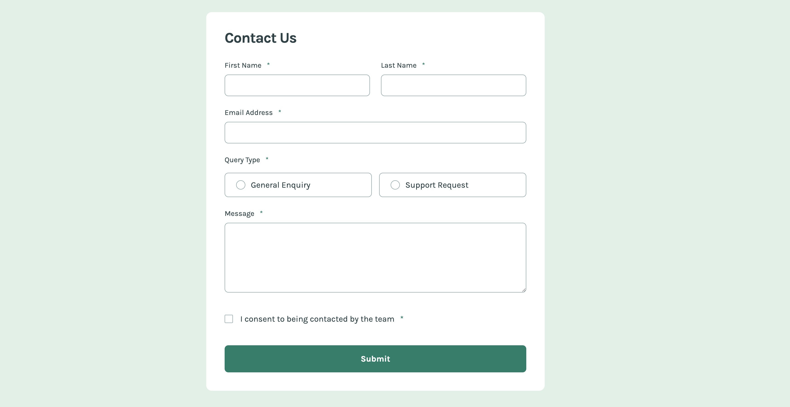

# Contact Form

## Table of contents

- [Overview](#overview)
  - [Screenshot](#screenshot)
  - [Links](#links)
- [My process](#my-process)
  - [Built with](#built-with)
- [Author](#author)

## Overview

### Screenshot

### Links

- Solution URL: [Solution URL](https://github.com/kisu-seo/contact_form)
- Live Site URL: [Live URL](https://kisu-seo.github.io/contact_form/)

## My process

### Built with

- **Semantic HTML5 Markup** - Structuring the form with `<main>`, `<section>`, `<form>`, `<fieldset>`, and `<legend>` for a meaningful and accessible document hierarchy.
- **CSS Custom Properties (Variables)** - Centralizing all design tokens (colors, typography, spacing, sizes) in `:root` for a single source of truth and easy scalability.
- **BEM Methodology** - Implementing the Block-Element-Modifier convention for a clear and maintainable class architecture (e.g., `.form__input`, `.form__input--error`, `.form__fieldset--error`).
- **Flexbox Layout** - Managing all form layouts with Flexbox: single-column on mobile, two-column (First/Last Name, Radio Group) on tablet and above.
- **Mobile-First Workflow** - Writing base styles for mobile and progressively enhancing the layout through Tablet (768px) and Desktop (1024px) media query breakpoints.
- **Google Fonts (Karla)** - Integrating 'Karla' (400 Regular, 700 Bold) for consistent typography across the form, loaded with `preconnect` and `display=swap` for performance.
- **Vanilla JavaScript** - Implementing client-side form validation (empty field checks, email regex), dynamic error state toggling, and a success toast notification without any external libraries.
- **Accessibility (a11y)** - Applying `aria-required`, `aria-describedby`, `aria-invalid`, `aria-live="polite"`, `aria-atomic`, `role="alert"`, and `.sr-only` for full screen reader support across all form interactions.
- **CSS `:has()` Selector** - Using the modern `:has()` pseudo-class to style a parent `.form__radio-label` card based on its child radio button's `:checked` state, eliminating the need for JavaScript.
- **CSS `:focus-visible`** - Providing keyboard focus indicators only for keyboard navigation (not mouse clicks) to satisfy both accessibility requirements and clean visual design.
- **Desktop-only Hover States** - Restricting all `:hover` interactions within `@media (min-width: 1024px)` to prevent the 'sticky hover' bug on touch-based devices.
- **Custom Styled Form Controls** - Fully restyling native radio buttons and checkboxes using `appearance: none` and SVG `background-image`, ensuring crisp rendering on all displays including retina screens.
- **`autocomplete` Attribute** - Annotating all text inputs with standard `autocomplete` values (`given-name`, `family-name`, `email`) to support browser autofill and password manager field recognition.

## Author

- Website - [Kisu Seo](https://github.com/kisu-seo)
- Frontend Mentor - [@kisu-seo](https://www.frontendmentor.io/profile/kisu-seo)
